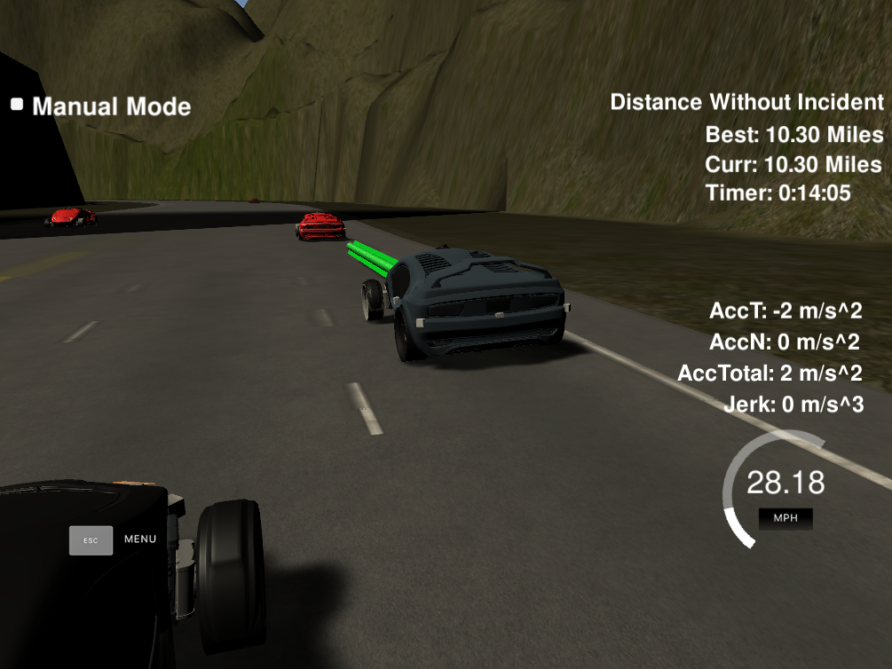

## Explanation of implementation

The core component of this project is the way the car decides when to change lane. These logic is captured by ComputeStateFunction in main.cpp. 
I followed a very simple approach (mainly due to lack of time). When I see a car close than 30m in my current lane, I first slow down, and then I check which lane I could switch to. First, I check if a lane-change to the left is possible. If not, I check the right. If no lane change is possible I keep my current lane by gradually slowing down.

To check if a lane change is possible, I used the information from the prediction module to check whether there is a car either 30m ahead or 10m behind. If no car is within range, changing lane is considered safe.

## Trajectory generatation
For the trajectory generation I used the code from the lectures. Briefly: having decided which lane to go we can create a trajectory using splines. We first add the two last points from the previous path to ensure smoothness. We add three more and feed them to the spline. It is important to note that we transform all the points to the car's local coordinate frame to facilitate mathematical computation. Next, I use the points from the previous path that were not consumed by the car's controller, and then using the newly computed spline I fill-up the remaining points to construct a new trajectory.

## Performance
The car drives without incidents around the track.
